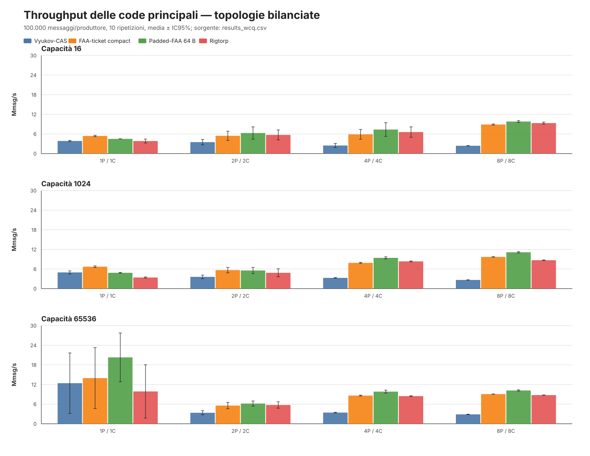
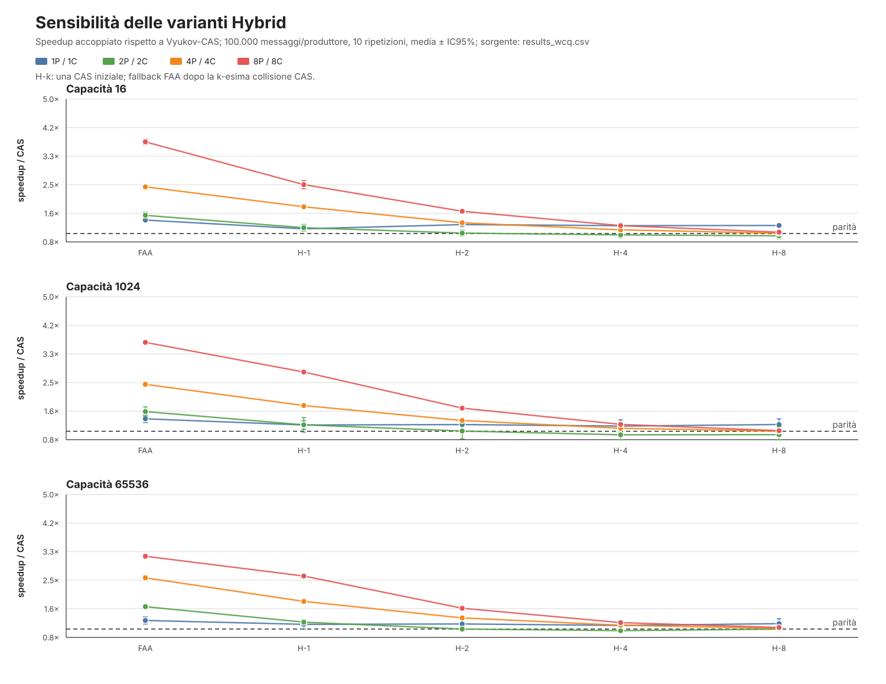
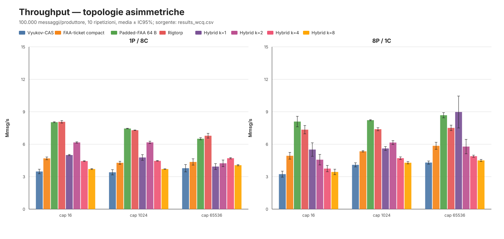

# Queue benchmark

This benchmark compares the CAS, FAA, Hybrid, Rigtorp, Padded-FAA,
bounded-LPRQ-inspired, and wCQ queues under the same concurrent workload.
Every run also checks the number and checksum of consumed messages.

`BoundedLPRQInspired` is deliberately named as an adaptation. The published
LPRQ is an unbounded list of PRQ segments; this implementation uses a fixed,
reusable ring and therefore does not inherit the original lock-freedom proof.
Its `try_push` and `try_pop` methods are weak single-attempt operations and can
fail spuriously under contention; the blocking benchmark paths retry them.

Build and run from the repository root:

```bash
mkdir -p /tmp/mostream-mojo-cache
make -C MoStream/lib wcq_native.o
MODULAR_CACHE_DIR=/tmp/mostream-mojo-cache \
  mojo build Benchmarks/QueueBenchmark/queue_benchmark.mojo \
  -I . -o /tmp/queue_benchmark \
  -Xlinker "$PWD/MoStream/lib/wcq_native.o"
/tmp/queue_benchmark
```

Optional arguments are:

```text
queue_benchmark messages_per_producer producers consumers capacity repetitions
```

For example:

```bash
/tmp/queue_benchmark 1000000 8 8 1024 10
```

Run multiple configurations rather than drawing conclusions from a single
result. Useful configurations include 1P/1C, 2P/2C, 4P/4C, and 8P/8C with
capacities 16, 1024, and 65536. Use a release build and an otherwise idle
machine for thesis measurements.

To run the complete balanced and unbalanced matrix and produce a CSV containing
means, sample standard deviations, and 95% confidence intervals:

```bash
python3 Benchmarks/QueueBenchmark/run_suite.py
```

Optional arguments select messages per producer, repetitions, and output path:

```bash
python3 Benchmarks/QueueBenchmark/run_suite.py \
  250000 30 Benchmarks/QueueBenchmark/results.csv
```

The runner builds and links the native wCQ bridge automatically. The wCQ
adapter is limited to x86-64 processors with `CMPXCHG16B`; it stores `UInt64`
values and requires a distinct dense thread ID for every concurrent caller.

The reproducible wCQ experiment from 2026-07-22 is in
`results_wcq.csv`; its interpretation and limitations are documented in
`WCQ_RESULTS.md`. Summarize any compatible result file with:

```bash
python3 Benchmarks/QueueBenchmark/analyze_wcq_results.py \
  Benchmarks/QueueBenchmark/results_wcq.csv
```

Summarize an LPRQ result CSV without external Python dependencies:

```bash
python3 Benchmarks/QueueBenchmark/analyze_lprq_results.py \
  Benchmarks/QueueBenchmark/results_bounded_lprq.csv
```

The per-consumer count and checksum are accumulated locally during the timed
region. This avoids adding a shared atomic operation to every queue operation.

## What the microbenchmark measures

This is not a complete MoStream `Communicator` benchmark. Each `run_*`
function constructs one raw bounded queue of `Int`, shared by `N` producer
tasks and `M` consumer tasks. There is no `MessageWrapper`, close/EOS
protocol, pipeline stage, or cooperative scheduler.

The workload is deliberately saturated:

- producer `p` calls blocking `push()` in a tight loop for the disjoint range
  `[p * messages, (p + 1) * messages)`;
- consumers call blocking `pop()` continuously and perform no artificial
  delay or application work;
- the last producer to finish inserts one sentinel per consumer;
- count and checksum validation detect lost or duplicated data after every
  run.

The timer starts after queue construction and result-array initialization, and
stops after the parallel region joins. It therefore includes worker
dispatch/join, all data transfers, and sentinel transfers. Queue construction,
result aggregation, and validation are outside the timed region. Throughput is
`N * messages / elapsed`: sentinel operations consume timed work but are not
included in the numerator. One `Mmsg/s` represents one completed message
transfer (one enqueue plus one dequeue), not one atomic instruction.

There is no explicit CPU pinning, dedicated warm-up phase, or delay between
operations. The current CSVs contain aggregate means, sample standard
deviations, and confidence intervals, but not the raw repetitions. This is a
maximum-pressure blocking-API microbenchmark; it does not model stage
computation and does not measure the cooperative runtime's `try_push` /
`try_pop` path.

## Queue names and provenance

| CSV label | Precise meaning |
|---|---|
| `CAS` | MoStream's bounded Vyukov-derived sequence ring: padded producer/consumer counters, compact slots, CAS reservation. |
| `FAA` | Experimental local bounded ticket-FAA sequence ring: padded counters and compact slots. Blocking `push/pop` reserve with FAA; `try_*` still uses CAS. |
| `PADDEDFAA` | The same local ticket-FAA approach, with each slot rounded to a cache-line multiple and the slot array aligned to 64 bytes. |
| `RIGTORP` | Mojo implementation of Rigtorp's bounded ticket/turn MPMC queue. |
| `HYBRIDk` | Local CAS-to-FAA experiment: a blocking operation falls back to FAA after its `k`-th genuine CAS collision. |
| `BLPRQ` | Fixed-ring LPRQ-inspired adaptation; not the published unbounded LPRQ. |
| `WCQ` | Adapter around the native bounded wCQ implementation, with a stable dense thread ID per caller. |

`FAA` is not “FAA without padding”: its producer and consumer counters are
already padded to 64 bytes; only its slots are compact. It is also not an
implementation of Yang and Mellor-Crummey's
[A Wait-Free Queue as Fast as Fetch-and-Add](https://doi.org/10.1145/2851141.2851168).
The file was introduced locally in commit `641e76a`. It combines Vyukov's
bounded per-slot sequence protocol with irrevocable FAA ticket allocation in
the blocking methods.

The closest established family is the ticketed circular-buffer design used by
the [CB-Queue paper](https://doi.org/10.1145/2086696.2086728) and by
[Rigtorp MPMCQueue](https://github.com/rigtorp/MPMCQueue#implementation).
However, `FAA_Queue.mojo` is a project experiment rather than a faithful port
of either implementation. In particular, it has no YMC fast/slow path,
per-thread helping, dynamic segment/reclamation scheme, or wait-free proof. A
thread that obtains an FAA ticket must wait for that exact slot.

For figures and thesis text, use the following unambiguous names:

- `Vyukov-CAS`;
- `FAA-ticket compact (Vyukov-derived)`;
- `Padded-FAA 64-B slots`;
- `Hybrid CAS→FAA (k=...)`;
- `Rigtorp ticket/turn`.

## Hybrid thresholds

`Hybrid-1`, `Hybrid-2`, `Hybrid-4`, and `Hybrid-8` are not four global
operating modes. The number is a per-operation threshold:

1. load the current producer or consumer position;
2. check whether the corresponding slot is available;
3. attempt CAS;
4. on success, complete the operation;
5. after `k` actual CAS losses, reserve a new ticket with FAA and wait for that
   ticket's slot.

A full/empty slot, or a slot reserved but not yet published, causes waiting but
does not increment the collision counter. The counter starts again from zero
for every `push()` or `pop()`. Consequently, `Hybrid-1` still performs one CAS
attempt before FAA; it is not equivalent to pure FAA.

All Hybrid `try_push/try_pop` operations ignore the threshold and use CAS only,
because an FAA reservation cannot be cancelled safely. The benchmark in this
directory calls blocking `push/pop`, so it does exercise the Hybrid fallback.
Fallback diagnostics are disabled during performance runs to avoid adding a
shared atomic update; the result tables therefore do not say how frequently
each Hybrid variant actually selected FAA.

## Reproducible plots

The complete, internally consistent `results_wcq.csv` run contains all queue
variants for the same 18 configurations. Generate dependency-free vector SVG
figures with:

```bash
python3 Benchmarks/QueueBenchmark/plot_results.py
```

An alternative aggregate CSV and output directory can be supplied explicitly:

```bash
python3 Benchmarks/QueueBenchmark/plot_results.py \
  Benchmarks/QueueBenchmark/results_wcq.csv \
  Benchmarks/QueueBenchmark/plots
```

The script validates that all plotted configurations use the same message
count and repetition count. It produces mean ± IC95% figures:

### Main queues, balanced topologies



### Hybrid threshold sensitivity



### Asymmetric topologies



The figures intentionally separate the comparisons instead of placing ten
series in a single plot. Since the source CSV stores only aggregates, these
figures cannot show boxplots, outliers, multimodality, or paired raw-sample
distributions. A future thesis-grade runner should retain every repetition.
